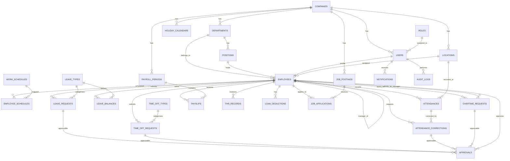

# ERD Plan: HRIS Samugara

> **Analisis oleh Senior Backend Engineer**  
> Berdasarkan mockup mobile/web + requirements dokumen (requirements.md, requirements-karyawan.md, requirements-admin-hr.md).

---

## 1. Executive Summary

Sistem HRIS Samugara memerlukan **~25 tabel inti** yang terbagi dalam 6 domain besar:

1. **Master Data** — perusahaan, departemen, jabatan, lokasi
2. **Identity & Access** — pengguna, peran, karyawan, hierarki atasan
3. **Workforce** — jadwal kerja, shift, mapping karyawan-jadwal
4. **Attendance** — absensi harian, koreksi absensi, log lokasi/foto
5. **Leave & Time Off** — jenis cuti, saldo cuti, pengajuan cuti, pengajuan izin
6. **Compensation** — lembur, payroll period, slip gaji, THR, kasbon
7. **Recruitment** — lowongan, pelamar, tracking status
8. **Platform** — approval flow, notifikasi, audit log, kalender kerja

---

## 2. Entity Relationship Diagram (Mermaid)



---

## 3. Detail Skema Tabel

### 3.1 Master Data

#### `companies`
| Kolom | Tipe | Constraint | Keterangan |
|-------|------|------------|------------|
| id | UUID | PK, DEFAULT gen_random_uuid() | |
| name | VARCHAR(255) | NOT NULL | PT Samugara |
| code | VARCHAR(50) | UNIQUE | Kode perusahaan |
| address | TEXT | | Alamat kantor pusat |
| phone | VARCHAR(20) | | |
| email | VARCHAR(255) | | |
| npwp | VARCHAR(50) | | NPWP perusahaan untuk PPh 21 |
| is_active | BOOLEAN | DEFAULT true | |
| created_at | TIMESTAMPTZ | DEFAULT now() | |
| updated_at | TIMESTAMPTZ | DEFAULT now() | |

#### `departments`
| Kolom | Tipe | Constraint | Keterangan |
|-------|------|------------|------------|
| id | UUID | PK | |
| company_id | UUID | FK → companies.id, ON DELETE CASCADE | |
| name | VARCHAR(255) | NOT NULL | |
| code | VARCHAR(50) | | Kode departemen |
| head_employee_id | UUID | FK → employees.id, NULL | Kepala departemen |
| created_at | TIMESTAMPTZ | DEFAULT now() | |

#### `positions`
| Kolom | Tipe | Constraint | Keterangan |
|-------|------|------------|------------|
| id | UUID | PK | |
| department_id | UUID | FK → departments.id, ON DELETE SET NULL | |
| name | VARCHAR(255) | NOT NULL | Nama jabatan |
| level | VARCHAR(50) | | staff, supervisor, manager, direktur |
| grade | VARCHAR(20) | | Grade golongan (opsional) |
| created_at | TIMESTAMPTZ | DEFAULT now() | |

#### `locations`
| Kolom | Tipe | Constraint | Keterangan |
|-------|------|------------|------------|
| id | UUID | PK | |
| company_id | UUID | FK → companies.id | |
| name | VARCHAR(255) | NOT NULL | Tegal Office, Tegal Lapangan, dll |
| type | VARCHAR(50) | NOT NULL | `fixed` / `flexible` |
| latitude | DECIMAL(10,8) | | |
| longitude | DECIMAL(11,8) | | |
| radius_meters | INTEGER | DEFAULT 100 | |
| address | TEXT | | Alamat lengkap |
| is_active | BOOLEAN | DEFAULT true | |
| created_at | TIMESTAMPTZ | DEFAULT now() | |

---

### 3.2 Identity & Access Management

#### `roles`
| Kolom | Tipe | Constraint | Keterangan |
|-------|------|------------|------------|
| id | UUID | PK | |
| name | VARCHAR(100) | NOT NULL, UNIQUE | `karyawan`, `atasan`, `manager_hrga`, `hrd`, `admin`, `super_admin` |
| display_name | VARCHAR(255) | | Nama tampilan UI |
| permissions | JSONB | DEFAULT '[]' | Array permission (RBAC granular) |
| created_at | TIMESTAMPTZ | DEFAULT now() | |

#### `users`
| Kolom | Tipe | Constraint | Keterangan |
|-------|------|------------|------------|
| id | UUID | PK | |
| role_id | UUID | FK → roles.id | |
| company_id | UUID | FK → companies.id | |
| employee_id | VARCHAR(100) | UNIQUE | Nomor karyawan (EMP-2024-0042) |
| email | VARCHAR(255) | UNIQUE, NOT NULL | |
| password_hash | VARCHAR(255) | NOT NULL | bcrypt/argon2 |
| full_name | VARCHAR(255) | NOT NULL | |
| phone | VARCHAR(20) | | |
| avatar_url | TEXT | | URL foto profil |
| fcm_token | TEXT | | Push notification token |
| is_active | BOOLEAN | DEFAULT true | |
| last_login_at | TIMESTAMPTZ | | |
| created_at | TIMESTAMPTZ | DEFAULT now() | |
| updated_at | TIMESTAMPTZ | DEFAULT now() | |

#### `employees`
| Kolom | Tipe | Constraint | Keterangan |
|-------|------|------------|------------|
| id | UUID | PK | |
| user_id | UUID | FK → users.id, UNIQUE, ON DELETE CASCADE | One-to-one |
| department_id | UUID | FK → departments.id | |
| position_id | UUID | FK → positions.id | |
| location_id | UUID | FK → locations.id | Lokasi kerja default |
| supervisor_id | UUID | FK → employees.id, NULL | Atasan langsung (self-ref) |
| manager_id | UUID | FK → employees.id, NULL | Manager HRGA (self-ref) |
| nik | VARCHAR(50) | UNIQUE | NIK karyawan (TG001) |
| full_name | VARCHAR(255) | NOT NULL | Denormalized dari users |
| gender | VARCHAR(20) | | male, female |
| birth_date | DATE | | |
| address | TEXT | | Alamat lengkap |
| employment_status | VARCHAR(50) | | `kontrak`, `permanen`, `probation` |
| join_date | DATE | | Tanggal bergabung |
| contract_end_date | DATE | | Untuk hitung 1 tahun (cuti) |
| resignation_date | DATE | NULL | Tanggal resign (untuk prorate) |
| base_salary | DECIMAL(15,2) | | Gaji pokok |
| fixed_allowance | DECIMAL(15,2) | | Tunjangan tetap |
| phone_allowance | DECIMAL(15,2) | DEFAULT 0 | Uang pulsa |
| dinas_allowance | DECIMAL(15,2) | DEFAULT 0 | Uang dinas |
| bpjs_payment_type | VARCHAR(50) | DEFAULT 'company' | `company` / `deducted` |
| shift_type | VARCHAR(50) | | `office`, `lapangan`, `security` |
| is_security | BOOLEAN | DEFAULT false | Flag khusus security |
| is_active | BOOLEAN | DEFAULT true | |
| created_at | TIMESTAMPTZ | DEFAULT now() | |
| updated_at | TIMESTAMPTZ | DEFAULT now() | |

**Index**: `employees(supervisor_id)`, `employees(manager_id)`, `employees(nik)`

---

### 3.3 Work Schedule

#### `work_schedules`
| Kolom | Tipe | Constraint | Keterangan |
|-------|------|------------|------------|
| id | UUID | PK | |
| name | VARCHAR(255) | NOT NULL | Tegal Office, Security Shift 1 |
| shift_code | VARCHAR(50) | | Shift 1, 2, 3 (nullable untuk non-shift) |
| schedule_type | VARCHAR(50) | NOT NULL | `normal`, `ramadhan` |
| start_time | TIME | | Jam masuk |
| end_time | TIME | | Jam pulang |
| break_start | TIME | NULL | |
| break_end | TIME | NULL | |
| work_days | INTEGER[] | | Array hari kerja [1,2,3,4,5] (Senin=1) |
| is_holiday_off | BOOLEAN | DEFAULT true | Libur tanggal merah? |
| notes | TEXT | | |
| created_at | TIMESTAMPTZ | DEFAULT now() | |

#### `employee_schedules`
Mapping karyawan ke jadwal (historis, bisa berganti).
| Kolom | Tipe | Constraint | Keterangan |
|-------|------|------------|------------|
| id | UUID | PK | |
| employee_id | UUID | FK → employees.id, ON DELETE CASCADE | |
| schedule_id | UUID | FK → work_schedules.id | |
| effective_date | DATE | NOT NULL | Mulai berlaku |
| end_date | DATE | NULL | Berakhir (NULL = masih berlaku) |
| created_at | TIMESTAMPTZ | DEFAULT now() | |

**Constraint**: UNIQUE(employee_id, effective_date) — atau gunakan non-overlapping date range check.

---

### 3.4 Attendance

#### `attendances`
| Kolom | Tipe | Constraint | Keterangan |
|-------|------|------------|------------|
| id | UUID | PK | |
| employee_id | UUID | FK → employees.id | |
| location_id | UUID | FK → locations.id | Lokasi absensi |
| attendance_date | DATE | NOT NULL | Tanggal absensi |
| clock_in | TIMESTAMPTZ | NULL | Waktu clock in |
| clock_out | TIMESTAMPTZ | NULL | Waktu clock out |
| clock_in_lat | DECIMAL(10,8) | | |
| clock_in_lng | DECIMAL(11,8) | | |
| clock_out_lat | DECIMAL(10,8) | | |
| clock_out_lng | DECIMAL(11,8) | | |
| clock_in_photo_url | TEXT | | URL foto selfie clock in |
| clock_out_photo_url | TEXT | | URL foto selfie clock out |
| clock_in_distance | INTEGER | | Jarak ke lokasi (meter) |
| clock_out_distance | INTEGER | | |
| status | VARCHAR(50) | | `on_time`, `late`, `early_leave`, `absent`, `incomplete` |
| late_minutes | INTEGER | DEFAULT 0 | |
| early_leave_minutes | INTEGER | DEFAULT 0 | |
| attendance_allowance | DECIMAL(15,2) | DEFAULT 0 | Uang kehadiran (0 jika tidak lengkap) |
| late_deduction | DECIMAL(15,2) | DEFAULT 0 | Potongan keterlambatan |
| is_holiday | BOOLEAN | DEFAULT false | Absen di hari libur (khusus security) |
| notes | TEXT | | Catatan sistem/admin |
| created_at | TIMESTAMPTZ | DEFAULT now() | |
| updated_at | TIMESTAMPTZ | DEFAULT now() | |

**Constraint**: UNIQUE(employee_id, attendance_date)
**Index**: `attendances(employee_id, attendance_date)`, `attendances(attendance_date, status)`

#### `attendance_corrections`
| Kolom | Tipe | Constraint | Keterangan |
|-------|------|------------|------------|
| id | UUID | PK | |
| attendance_id | UUID | FK → attendances.id | |
| employee_id | UUID | FK → employees.id | Pemohon |
| submitted_by | UUID | FK → users.id | Bisa karyawan, admin, atau atasan |
| correction_type | VARCHAR(50) | NOT NULL | `wrong_attendance`, `forgot_clock_in`, `forgot_clock_out` |
| correct_clock_in | TIME | NULL | Jam yang benar |
| correct_clock_out | TIME | NULL | |
| reason | TEXT | NOT NULL | |
| status | VARCHAR(50) | DEFAULT 'pending' | `pending`, `approved`, `rejected` |
| supervisor_approved_at | TIMESTAMPTZ | NULL | |
| hrga_approved_at | TIMESTAMPTZ | NULL | |
| supervisor_id | UUID | FK → employees.id | |
| hrga_manager_id | UUID | FK → employees.id | |
| rejection_reason | TEXT | NULL | |
| created_at | TIMESTAMPTZ | DEFAULT now() | |
| updated_at | TIMESTAMPTZ | DEFAULT now() | |

---

### 3.5 Leave

#### `leave_types`
| Kolom | Tipe | Constraint | Keterangan |
|-------|------|------------|------------|
| id | UUID | PK | |
| name | VARCHAR(255) | NOT NULL | Annual Leave, Sick Leave, Umrah Leave, Government Mandatory |
| code | VARCHAR(50) | UNIQUE | |
| default_days | INTEGER | DEFAULT 0 | Saldo default per tahun |
| is_annual | BOOLEAN | DEFAULT false | Apakah mengurangi saldo tahunan? |
| is_paid | BOOLEAN | DEFAULT true | Apakah berbayar? |
| requires_attachment | BOOLEAN | DEFAULT false | Perlu lampiran (surat dokter, dll) |
| max_days_per_request | INTEGER | NULL | Batas maksimal per pengajuan |
| created_at | TIMESTAMPTZ | DEFAULT now() | |

#### `leave_balances`
| Kolom | Tipe | Constraint | Keterangan |
|-------|------|------------|------------|
| id | UUID | PK | |
| employee_id | UUID | FK → employees.id | |
| leave_type_id | UUID | FK → leave_types.id | |
| year | INTEGER | NOT NULL | |
| total_days | INTEGER | NOT NULL | Total saldo |
| used_days | INTEGER | DEFAULT 0 | |
| remaining_days | INTEGER | GENERATED ALWAYS AS (total_days - used_days) STORED | |
| created_at | TIMESTAMPTZ | DEFAULT now() | |
| updated_at | TIMESTAMPTZ | DEFAULT now() | |

**Constraint**: UNIQUE(employee_id, leave_type_id, year)

#### `leave_requests`
| Kolom | Tipe | Constraint | Keterangan |
|-------|------|------------|------------|
| id | UUID | PK | |
| employee_id | UUID | FK → employees.id | |
| leave_type_id | UUID | FK → leave_types.id | |
| start_date | DATE | NOT NULL | |
| end_date | DATE | NOT NULL | |
| total_days | INTEGER | NOT NULL | Total hari cuti |
| reason | TEXT | NOT NULL | |
| attachment_url | TEXT | NULL | |
| status | VARCHAR(50) | DEFAULT 'pending' | |
| supervisor_approved_at | TIMESTAMPTZ | NULL | |
| hrga_approved_at | TIMESTAMPTZ | NULL | |
| supervisor_id | UUID | FK → employees.id | |
| hrga_manager_id | UUID | FK → employees.id | |
| rejection_reason | TEXT | NULL | |
| created_at | TIMESTAMPTZ | DEFAULT now() | |
| updated_at | TIMESTAMPTZ | DEFAULT now() | |

---

### 3.6 Time Off (Izin Non-Cuti)

#### `time_off_types`
| Kolom | Tipe | Constraint | Keterangan |
|-------|------|------------|------------|
| id | UUID | PK | |
| name | VARCHAR(255) | NOT NULL | Late Arrival, Early Leave, Absence (Sick), Absence (Important Business) |
| code | VARCHAR(50) | UNIQUE | |
| affects_salary | BOOLEAN | DEFAULT false | Apakah mempengaruhi gaji? |
| requires_attachment | BOOLEAN | DEFAULT false | |
| created_at | TIMESTAMPTZ | DEFAULT now() | |

#### `time_off_requests`
| Kolom | Tipe | Constraint | Keterangan |
|-------|------|------------|------------|
| id | UUID | PK | |
| employee_id | UUID | FK → employees.id | |
| time_off_type_id | UUID | FK → time_off_types.id | |
| date | DATE | NOT NULL | Tanggal izin |
| start_time | TIME | NULL | Jam mulai (terlambat/pulang cepat) |
| end_time | TIME | NULL | Jam selesai |
| reason | TEXT | NOT NULL | |
| attachment_url | TEXT | NULL | |
| status | VARCHAR(50) | DEFAULT 'pending' | |
| supervisor_approved_at | TIMESTAMPTZ | NULL | |
| hrga_approved_at | TIMESTAMPTZ | NULL | |
| supervisor_id | UUID | FK → employees.id | |
| hrga_manager_id | UUID | FK → employees.id | |
| rejection_reason | TEXT | NULL | |
| created_at | TIMESTAMPTZ | DEFAULT now() | |
| updated_at | TIMESTAMPTZ | DEFAULT now() | |

---

### 3.7 Overtime

#### `overtime_requests`
| Kolom | Tipe | Constraint | Keterangan |
|-------|------|------------|------------|
| id | UUID | PK | |
| employee_id | UUID | FK → employees.id | Karyawan yang lembur |
| requested_by | UUID | FK → employees.id | Atasan yang mengajukan |
| date | DATE | NOT NULL | |
| start_time | TIME | NOT NULL | |
| end_time | TIME | NOT NULL | |
| total_hours | DECIMAL(4,2) | NOT NULL | Total jam (sudah dibulatkan) |
| raw_minutes | INTEGER | | Durasi mentah dalam menit |
| day_type | VARCHAR(50) | NOT NULL | `workday`, `saturday`, `sunday`, `holiday` |
| description | TEXT | NOT NULL | Deskripsi pekerjaan |
| rate_per_hour | DECIMAL(15,2) | NOT NULL | Rate per jam saat pengajuan |
| total_overtime_pay | DECIMAL(15,2) | DEFAULT 0 | Total bayaran lembur |
| total_meal_allowance | DECIMAL(15,2) | DEFAULT 0 | Total uang makan lembur |
| status | VARCHAR(50) | DEFAULT 'pending' | `pending`, `approved`, `rejected` |
| manager_approved_at | TIMESTAMPTZ | NULL | |
| hrd_processed_at | TIMESTAMPTZ | NULL | HRD rekap |
| manager_id | UUID | FK → employees.id | |
| hrd_id | UUID | FK → employees.id | |
| rejection_reason | TEXT | NULL | |
| created_at | TIMESTAMPTZ | DEFAULT now() | |
| updated_at | TIMESTAMPTZ | DEFAULT now() | |

#### `overtime_meal_allowances`
Referensi uang makan lembur (bisa di-hardcode di app, tapi lebih baik di DB untuk maintainability).
| Kolom | Tipe | Constraint | Keterangan |
|-------|------|------------|------------|
| id | UUID | PK | |
| day_type | VARCHAR(50) | NOT NULL | `workday`, `saturday`, `sunday_holiday` |
| time_start | TIME | NOT NULL | |
| time_end | TIME | NOT NULL | |
| amount | DECIMAL(15,2) | NOT NULL | |
| created_at | TIMESTAMPTZ | DEFAULT now() | |

---

### 3.8 Payroll & Compensation

#### `payroll_periods`
| Kolom | Tipe | Constraint | Keterangan |
|-------|------|------------|------------|
| id | UUID | PK | |
| company_id | UUID | FK → companies.id | |
| month | INTEGER | NOT NULL | 1-12 |
| year | INTEGER | NOT NULL | |
| period_name | VARCHAR(255) | NOT NULL | April 2026 |
| start_date | DATE | | |
| end_date | DATE | | |
| attendance_cutoff_start | DATE | | Cut off uang kehadiran/lembur (tgl 26) |
| attendance_cutoff_end | DATE | | Cut off uang kehadiran/lembur (tgl 25) |
| payment_date | DATE | | Tanggal 30/31 |
| status | VARCHAR(50) | DEFAULT 'draft' | `draft`, `processed`, `paid` |
| created_at | TIMESTAMPTZ | DEFAULT now() | |

#### `payslips`
| Kolom | Tipe | Constraint | Keterangan |
|-------|------|------------|------------|
| id | UUID | PK | |
| employee_id | UUID | FK → employees.id | |
| payroll_period_id | UUID | FK → payroll_periods.id | |
| base_salary | DECIMAL(15,2) | NOT NULL | Gaji pokok |
| fixed_allowance | DECIMAL(15,2) | DEFAULT 0 | Tunjangan tetap |
| attendance_allowance | DECIMAL(15,2) | DEFAULT 0 | Uang kehadiran |
| phone_allowance | DECIMAL(15,2) | DEFAULT 0 | Uang pulsa |
| dinas_allowance | DECIMAL(15,2) | DEFAULT 0 | Uang dinas |
| overtime_pay | DECIMAL(15,2) | DEFAULT 0 | Bayaran lembur |
| overtime_meal_allowance | DECIMAL(15,2) | DEFAULT 0 | Uang makan lembur |
| late_deduction | DECIMAL(15,2) | DEFAULT 0 | Potongan terlambat |
| loan_deduction | DECIMAL(15,2) | DEFAULT 0 | Potongan kasbon |
| bpjs_kesehatan | DECIMAL(15,2) | DEFAULT 0 | |
| bpjs_ketenagakerjaan | DECIMAL(15,2) | DEFAULT 0 | |
| pph21 | DECIMAL(15,2) | DEFAULT 0 | |
| other_deductions | DECIMAL(15,2) | DEFAULT 0 | |
| prorate_days_worked | INTEGER | NULL | Hari masuk (untuk prorate) |
| prorate_days_effective | INTEGER | NULL | Hari kerja efektif |
| is_prorated | BOOLEAN | DEFAULT false | |
| gross_income | DECIMAL(15,2) | NOT NULL | Total pendapatan kotor |
| total_deductions | DECIMAL(15,2) | DEFAULT 0 | |
| net_income | DECIMAL(15,2) | NOT NULL | Take home pay |
| pdf_url | TEXT | NULL | URL file PDF slip gaji |
| status | VARCHAR(50) | DEFAULT 'draft' | `draft`, `published` |
| published_at | TIMESTAMPTZ | NULL | |
| created_at | TIMESTAMPTZ | DEFAULT now() | |
| updated_at | TIMESTAMPTZ | DEFAULT now() | |

#### `loan_deductions`
Kasbon / pinjaman karyawan yang dipotong bertahap.
| Kolom | Tipe | Constraint | Keterangan |
|-------|------|------------|------------|
| id | UUID | PK | |
| employee_id | UUID | FK → employees.id | |
| amount | DECIMAL(15,2) | NOT NULL | Total pinjaman |
| remaining_amount | DECIMAL(15,2) | NOT NULL | Sisa pinjaman |
| monthly_deduction | DECIMAL(15,2) | NOT NULL | Potongan per bulan |
| description | TEXT | | Keterangan kasbon |
| status | VARCHAR(50) | DEFAULT 'active' | `active`, `paid_off` |
| created_at | TIMESTAMPTZ | DEFAULT now() | |
| updated_at | TIMESTAMPTZ | DEFAULT now() | |

#### `thr_records`
| Kolom | Tipe | Constraint | Keterangan |
|-------|------|------------|------------|
| id | UUID | PK | |
| employee_id | UUID | FK → employees.id | |
| period_name | VARCHAR(255) | NOT NULL | Lebaran 2026, Natal 2026 |
| base_salary | DECIMAL(15,2) | NOT NULL | Gaji pokok saat perhitungan |
| months_worked | INTEGER | NOT NULL | Masa kerja dalam bulan |
| thr_amount | DECIMAL(15,2) | NOT NULL | Total THR |
| is_prorated | BOOLEAN | DEFAULT false | |
| status | VARCHAR(50) | DEFAULT 'draft' | `draft`, `approved`, `paid` |
| paid_at | TIMESTAMPTZ | NULL | |
| created_at | TIMESTAMPTZ | DEFAULT now() | |
| updated_at | TIMESTAMPTZ | DEFAULT now() | |

---

### 3.9 Recruitment

#### `job_postings`
| Kolom | Tipe | Constraint | Keterangan |
|-------|------|------------|------------|
| id | UUID | PK | |
| company_id | UUID | FK → companies.id | |
| title | VARCHAR(255) | NOT NULL | Judul lowongan |
| department_id | UUID | FK → departments.id | |
| position_id | UUID | FK → positions.id | |
| location_id | UUID | FK → locations.id | |
| description | TEXT | NOT NULL | |
| requirements | TEXT | | |
| employment_type | VARCHAR(50) | | full-time, shift, contract |
| status | VARCHAR(50) | DEFAULT 'draft' | `draft`, `active`, `closed` |
| public_slug | VARCHAR(255) | UNIQUE | URL-friendly slug untuk sharing |
| opened_at | DATE | | |
| closed_at | DATE | | |
| created_by | UUID | FK → users.id | |
| created_at | TIMESTAMPTZ | DEFAULT now() | |
| updated_at | TIMESTAMPTZ | DEFAULT now() | |

#### `job_applications`
| Kolom | Tipe | Constraint | Keterangan |
|-------|------|------------|------------|
| id | UUID | PK | |
| job_posting_id | UUID | FK → job_postings.id | |
| full_name | VARCHAR(255) | NOT NULL | |
| email | VARCHAR(255) | NOT NULL | |
| phone | VARCHAR(20) | | |
| resume_url | TEXT | | |
| cover_letter | TEXT | | |
| status | VARCHAR(50) | DEFAULT 'new' | `new`, `review`, `interview`, `lolos`, `ditolak` |
| rejection_email_sent | BOOLEAN | DEFAULT false | |
| rejection_email_sent_at | TIMESTAMPTZ | NULL | |
| notes | TEXT | | Catatan HR |
| created_at | TIMESTAMPTZ | DEFAULT now() | |
| updated_at | TIMESTAMPTZ | DEFAULT now() | |

---

### 3.10 Platform & Utilities

#### `holiday_calendars`
Kalender libur nasional & cuti bersama.
| Kolom | Tipe | Constraint | Keterangan |
|-------|------|------------|------------|
| id | UUID | PK | |
| company_id | UUID | FK → companies.id | |
| holiday_date | DATE | NOT NULL | |
| name | VARCHAR(255) | NOT NULL | Hari Raya Idul Fitri, dll |
| type | VARCHAR(50) | NOT NULL | `national_holiday`, `collective_leave` |
| is_recurring | BOOLEAN | DEFAULT false | Apakah berulang setiap tahun? |
| year | INTEGER | NOT NULL | |
| created_at | TIMESTAMPTZ | DEFAULT now() | |

**Constraint**: UNIQUE(company_id, holiday_date)

#### `approvals`
Tabel generic polymorphic untuk tracking semua approval.
| Kolom | Tipe | Constraint | Keterangan |
|-------|------|------------|------------|
| id | UUID | PK | |
| approvable_type | VARCHAR(100) | NOT NULL | `leave_request`, `time_off_request`, `attendance_correction`, `overtime_request` |
| approvable_id | UUID | NOT NULL | |
| approver_id | UUID | FK → employees.id | |
| approver_role | VARCHAR(50) | NOT NULL | `supervisor`, `manager_hrga`, `manager`, `hrd` |
| level | INTEGER | NOT NULL | Urutan level: 1, 2, 3 |
| action | VARCHAR(50) | NOT NULL | `approved`, `rejected` |
| notes | TEXT | NULL | |
| acted_at | TIMESTAMPTZ | DEFAULT now() | |
| created_at | TIMESTAMPTZ | DEFAULT now() | |

**Index**: `approvals(approvable_type, approvable_id)`, `approvals(approver_id, action)`

#### `notifications`
| Kolom | Tipe | Constraint | Keterangan |
|-------|------|------------|------------|
| id | UUID | PK | |
| user_id | UUID | FK → users.id | Penerima |
| type | VARCHAR(100) | NOT NULL | `leave_approved`, `overtime_rejected`, `payslip_published`, `approval_pending` |
| title | VARCHAR(255) | NOT NULL | |
| message | TEXT | NOT NULL | |
| reference_type | VARCHAR(100) | | Polymorphic reference |
| reference_id | UUID | | |
| is_read | BOOLEAN | DEFAULT false | |
| read_at | TIMESTAMPTZ | NULL | |
| created_at | TIMESTAMPTZ | DEFAULT now() | |

**Index**: `notifications(user_id, is_read, created_at)`

#### `audit_logs`
| Kolom | Tipe | Constraint | Keterangan |
|-------|------|------------|------------|
| id | UUID | PK | |
| table_name | VARCHAR(100) | NOT NULL | |
| record_id | UUID | NOT NULL | |
| action | VARCHAR(50) | NOT NULL | `INSERT`, `UPDATE`, `DELETE` |
| old_values | JSONB | NULL | |
| new_values | JSONB | NULL | |
| performed_by | UUID | FK → users.id | |
| performed_at | TIMESTAMPTZ | DEFAULT now() | |

**Index**: `audit_logs(table_name, record_id, performed_at)`

---

## 4. Approval Flow Matrix

| Modul | Pengaju | Level 1 | Level 2 | Level 3 | Final Rekap |
|-------|---------|---------|---------|---------|-------------|
| Cuti | Karyawan | Atasan (supervisor) | Manager HRGA | — | — |
| Izin (Time Off) | Karyawan | Atasan (supervisor) | Manager HRGA | — | — |
| Koreksi Absensi | Karyawan | Atasan (supervisor) | Manager HRGA | — | — |
| Lembur | Atasan/SPV/Manager | Manager ACC | HRD rekap | — | HRD |

**Catatan**: Admin dan Super Admin dapat **override** — membuat atau mengedit pengajuan atas nama karyawan (field `submitted_by` pada tabel terkait).

---

## 5. Business Logic & Triggers

### 5.1 Auto-Calculation Triggers (PostgreSQL Functions)

```sql
-- 1. Auto-update updated_at pada semua tabel
CREATE OR REPLACE FUNCTION update_updated_at_column()
RETURNS TRIGGER AS $$
BEGIN
    NEW.updated_at = NOW();
    RETURN NEW;
END;
$$ language 'plpgsql';

-- 2. Pembulatan jam lembur
-- 1-30 menit = 0.5 jam
-- 31-60 menit = 1 jam
-- 1 jam 1 menit - 1 jam 30 menit = 1.5 jam
-- 1 jam 31 menit - 2 jam = 2 jam (dst, pembulatan ke atas per 30 menit)

-- 3. Auto-calculate late_deduction pada attendances
-- Jika late_minutes > 5 AND tidak ada time_off request approved untuk tanggal tersebut
-- late_deduction = CEIL(late_minutes / 60.0) * 5000

-- 4. Auto-update leave_balances.used_days
-- Trigger AFTER INSERT/UPDATE/DELETE pada leave_requests (status='approved')

-- 5. Auto-calculate payslip.net_income
-- net_income = gross_income - total_deductions
```

### 5.2 Constraint & Validasi

- `attendances(employee_id, attendance_date)` → UNIQUE
- `leave_balances(employee_id, leave_type_id, year)` → UNIQUE
- `holiday_calendars(company_id, holiday_date)` → UNIQUE
- `job_postings(public_slug)` → UNIQUE
- `users(email)` → UNIQUE
- `employees(nik)` → UNIQUE
- `employees(user_id)` → UNIQUE

---

## 6. Indexing Strategy

| Tabel | Index | Tujuan |
|-------|-------|--------|
| attendances | `(employee_id, attendance_date)` | Dashboard karyawan, rekap harian |
| attendances | `(attendance_date, status)` | Dashboard admin, statistik kehadiran |
| attendance_corrections | `(employee_id, status)` | Daftar koreksi pending |
| leave_requests | `(employee_id, status)` | Dashboard karyawan |
| leave_requests | `(status, created_at)` | Approval center |
| time_off_requests | `(employee_id, status)` | Dashboard karyawan |
| overtime_requests | `(employee_id, status)` | Dashboard karyawan & HRD |
| overtime_requests | `(status, date)` | Rekap lembur |
| payslips | `(employee_id, payroll_period_id)` | Lookup slip gaji |
| payslips | `(payroll_period_id, status)` | Generate batch |
| job_applications | `(job_posting_id, status)` | Filter pelamar per loker |
| notifications | `(user_id, is_read, created_at)` | Unread count, inbox |
| approvals | `(approvable_type, approvable_id)` | Polymorphic lookup |
| approvals | `(approver_id, action)` | History approval |
| audit_logs | `(table_name, record_id, performed_at)` | Audit trail |

---

## 7. Pertimbangan Skalabilitas & Arsitektur

### 7.1 Multi-tenancy
Tabel `companies` sebagai root tenant. Semua tabel master memiliki `company_id`. Untuk single-tenant deployment (PT Samugara saja), `company_id` dapat di-hardcode atau diabaikan di query layer.

### 7.2 Soft Delete
Gunakan `deleted_at` (TIMESTAMPTZ, NULL) pada tabel kritis (employees, users, job_postings) untuk recovery data. Tabel transaksi (attendances, payslips) tidak perlu soft delete — gunakan reversal/correction flow.

### 7.3 File Storage
Foto absensi (`clock_in_photo_url`, `clock_out_photo_url`) dan lampiran (`attachment_url`, `resume_url`, `pdf_url`) disimpan di object storage (S3/MinIO/Cloudflare R2) dengan path terstruktur:
```
/{company_id}/attendance/{employee_id}/{date}_{clock_in|clock_out}.jpg
/{company_id}/payslips/{period_id}/{employee_id}.pdf
/{company_id}/resumes/{application_id}.pdf
```

### 7.4 Payroll Computation
Perhitungan payroll sebaiknya dijalankan sebagai **background job** (queue/worker) karena:
- Memerlukan scan seluruh attendance & overtime per periode
- Perhitungan PPh 21 cukup kompleks
- Generate PDF slip gaji bersifat I/O intensive

### 7.5 Notification Strategy
Gunakan event-driven architecture:
- PostgreSQL `NOTIFY` / trigger → message queue (Redis/RabbitMQ)
- Worker mengirim push notification (FCM) dan email (SMTP/SES)
- Tabel `notifications` sebagai inbox persistence

---

## 8. Rekomendasi Teknologi Stack

| Layer | Rekomendasi |
|-------|-------------|
| Database | PostgreSQL 15+ (UUID, JSONB, Array, Trigger) |
| Cache | Redis (sessions, rate limiting, queue) |
| Queue | Bull/BullMQ (Node.js) atau Celery (Python) |
| ORM | Prisma / TypeORM / Sequelize |
| Object Storage | MinIO / AWS S3 / Cloudflare R2 |
| Push Notif | Firebase Cloud Messaging (FCM) |
| Email | Amazon SES / Mailgun / SMTP |
| PDF Generation | Puppeteer + HTML template / PDFKit |

---

## 9. Evolusi Skema (Future-proofing)

| Fitur Masa Depan | Tabel Tambahan |
|------------------|----------------|
| Performance Review | `performance_reviews`, `performance_goals`, `performance_competencies` |
| Training & Development | `training_programs`, `training_enrollments`, `certifications` |
| Asset Management | `company_assets`, `asset_assignments` |
| Multi-cabang | `branches` (relasi ke departments, locations, employees) |
| API Integrasi BPJS | `bpjs_configs`, `bpjs_sync_logs` |
| Advanced Analytics | `attendance_summaries` (materialized view) |

---

*Dokumen ini merupakan hasil analisis comprehensive untuk implementasi backend HRIS Samugara.*
